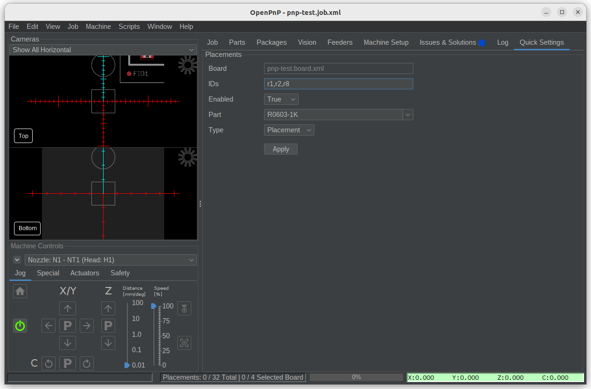

# OpenPnP Extension for Quick Settings

## About
This extension provides a quick way to configure placements of boards in a job.
The extension adds "Quick Settings" tab that can be used to configure the parameters for several placements at once. 



**NOTE:** This extension is being actively developed. That means, there can be bugs and  features will be added/removed at any time.

## Installing

* Clone this repository or download as zip file and extract.
  ```bash
  git clone <repository URL>
  ```

* Edit `.openpnp2/scripts/Events/Startup.py` and append the following. For, more details about `Startup.py` refer OpenPnP's [wiki page](https://github.com/openpnp/openpnp/wiki/Scripting).
  ```python
  import sys
  sys.path.append("<cloned or extracted location>")
  import blixt
  
  blixt.extension.init({'config': config, 'machine': machine, 'gui': gui, 'scripting': scripting})
  ```